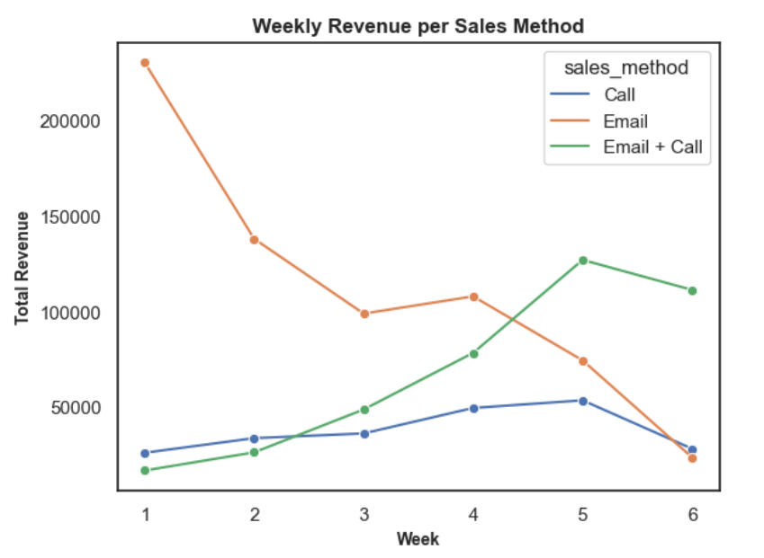

# Product Sales Analysis - Data Analyst Certification Examination Submission
An analysis of the marketing strategy for Pen and Printers, a company that provides high quality office products to large organizations and founded in 1984. They have built long lasting relationships with our customers and they trust us to provide them with the best products for them. As the way in which consumers buy products is changing, our sales tactics have to change too. Launching a new product line is expensive and we need to make sure we are using the best techniques to sell the new product effectively. The best approach may vary for each new product so we need to learn quickly what works and what doesn’t.

# Task
We need to know:
- How many customers were there for each approach?
- What does the spread of the revenue look like overall? And for each method?
- Was there any difference in revenue over time for each of the methods?
- Based on the data, which method would you recommend we continue to use? Some
of these methods take more time from the team so they may not be the best for us
to use if the results are similar.

# Dataset
The data only relates to the new products sold. As there are multiple different products, the revenue will vary depending on which products were sold. The data hasn’t been validated, so make sure that you check it against all of the information in the table before you start your analysis.

- **week**: Week sale was made, counted as weeks since product launch
- **sales_method**; Character, which of the three sales methods were used for that customer
- **customer_id**: Character, unique identifier for the customer
- **nb_sold**: Numeric, number of new products sold
- **revenue**: Numeric, revenue from the sales, rounded to 2 decimal places.
- **years_as_customer**: Numeric, number of years customer has been buying from us (company founded in 1984)
- **nb_site_visits**: Numeric, number of times the customer has visited our website in the last 6 months
- **state:** Character, location of the customer i.e. where orders are shipped

# Data Validation
The data set contains 15,000 observations and 8 features before the cleaning and validation process. Using the validation criteria, the following validation was made:

- **week**: 6 unique values, without any missing data.
- **sales_method**: had 5 unique values before validation: Email, Call, Email + Call, em + call, and email, which after validation were Email, Call, and Email + Call.
- **customer_id**: 15,000 unique values. Needed no cleaning.
- **nb_sold**: 10 unique values, needed no cleaning and no missing values.
- **revenue**: had 1074 missing values, of which the rows were dropped from the data set.
- **years as customer**: had two major values not corresponding: 47 and 63 which were way more than the number of years Pens and Printers has been in existence, 39 years. It made no sense having a customer when the business was not in existence. These rows were dropped.
- **nb_site_visits**: Needed to cleaning.
- **state**: Needed to cleaning too.

At the end of the validation and cleaning process, the data conatined **13,924** rows and **8** columns.

# Metrics Evaluated
- sales method
- incremental change in approach revenue

# Recommendations
from the analysis performed using the data provided, the following are recommended:

- Use key metrics to monitor whether there is a change in the sales approach.
- The Email method should be used frequently to communicate new products to customers, then a follow up call in the second and third week to talk about their needs and how the new product will support their work. This recommendation is based on the result obyained from 3 above.
- The Call method should be used less often, and if possible not at all. This is because it takes more time to make sales via this means and in the end it generates the least revenue, even with a high number of sales.
- The sales team should focus more on the Email and Email + Call approaches. As evident in 3 above, Email sales approach generate the most revenues within the first three weeks, though with a decline as the week progresses. This should be followed up with a call from the second or third week to further boost sales, and hence further generate more revenue.
- Expand their customer segment by improving marketing means and conversion rate based on the website visits. This is evident in 4 above, the longer the customer stays, the less revenue generated from the particular customer. Thus to mitigate this, new customers should be on-boarded and a retention means developed for existing customers to increase sales.
- Accurate data collation to enable in-depth analysis, especially in the revenue, which had lots of missing values.
